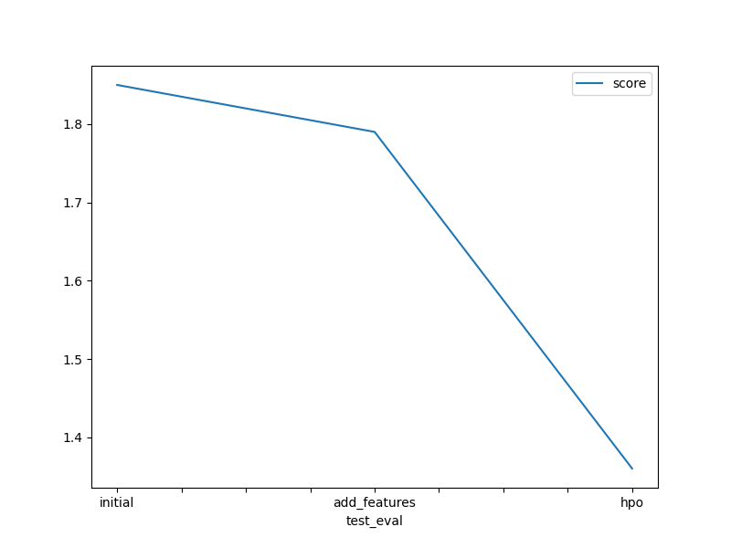

# Report: Predict Bike Sharing Demand with AutoGluon Solution
#### Mehran Moazeni

## Initial Training
### What did you realize when you tried to submit your predictions? What changes were needed to the output of the predictor to submit your results?
So one of the things tht awe have to first change was the negative prediciotns. Kaggle doesnt support doesn becuase the target variable can not be negative. So we had to change the negative predictions to 0. Then submisstion was okay.

### What was the top ranked model that performed?
The best score i got was with hyperparameter tuning. The best model was the `WeightedEnsemble_L3` model. With hyper tuning i could reach to 1.36 on the RMSE score.

## Exploratory data analysis and feature creation
### What did the exploratory analysis find and how did you add additional features?
I thought maybe wokring days and holdiays and weekends could be an important factor for prediction of the demand. So i added the `workingday`, `holiday` and `weekend` features to the dataset. I define one funciton and then add these columns to the dataset.

### How much better did your model preform after adding additional features and why do you think that is?
I could say a bit. The RMSLE score was 1.85 before adding the features and after adding the features it was 1.79. So it was a bit better. I think the reason is that the demand of the bikes could be different in the working days and holidays and weekends. So it could be a good feature to add to the dataset.

## Hyper parameter tuning
### How much better did your model preform after trying different hyper parameters?
It got much better. The RMSE score was 1.79 before hyperparameter tuning and after tuning it was 1.36. So it was a big improvement.

### If you were given more time with this dataset, where do you think you would spend more time?
I will definitly try more Hyperparameter tuning by adding more range of parameters. But also on top of that feature engineerng! Maybe adding more features could help like the weather or the temperature of the day, the hour of the day, etc.

### Create a table with the models you ran, the hyperparameters modified, and the kaggle score.
|model|GMB|XGB|CAT|score|
|--|--|--|--|--|
|initial|Default|Default|Default|1.85|
|add_features|Default|Default|Default|1.79|
|hpo|num_boost_round=25|n_estimator=100|iteration=25|1.36|

### Create a line plot showing the top model score for the three (or more) training runs during the project.

### Create a line plot showing the top kaggle score for the three (or more) prediction submissions during the project.

## Summary
n the bike-sharing demand competition, we developed models to predict bike rental demand. Initially, we observed that LightGBM (Gradient Boosting Machine) performed well. Through exploratory analysis, we identified key factors, such as time of day and date, that significantly impacted demand. We enhanced the model by creating additional features, including calendar-wise variables, which improved predictions. We conducted hyperparameter tuning for LightGBM, XGBoost, and CatBoost, optimizing their configurations for better performance. With additional time, we would focus on refining feature engineering, exploring advanced ensemble methods, and experimenting with other models. Further hyperparameter tuning and advanced optimization techniques would also be beneficial.